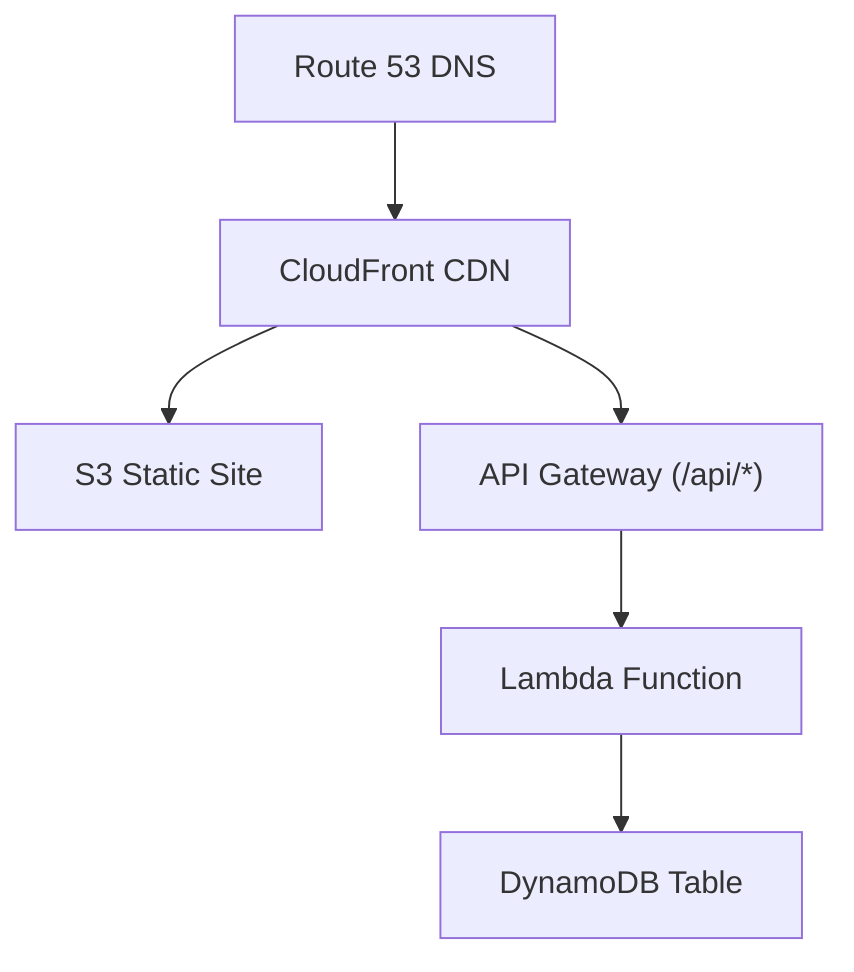

# Cloud Resume (AWS Edition)

> A fully serverless, Infrastructure as Code stack for hosting a resume — fast, scalable, and inexpensive.

[](../../actions)

---

## Why this project?

The [Cloud Resume Challenge](https://cloudresumechallenge.dev) demonstrates practical cloud skills by delivering a static resume site that

* is served over HTTPS at a custom domain  
* tracks visitors in a durable, serverless database  
* is provisioned entirely with Infrastructure as Code  
* ships automatically through CI/CD

This repository is an AWS implementation using **Terraform** and **GitHub Actions** so anyone can fork and adapt it quickly.

---

## High‑level architecture



| Component       | Purpose                                                                  |
| --------------- | ------------------------------------------------------------------------ |
| **S3**          | Stores the static HTML, CSS, and JavaScript for the resume               |
| **CloudFront**  | Global CDN and TLS termination (ACM certificate in us‑east‑1)            |
| **Route 53**    | A/AAAA records for the domain pointing to the CloudFront distribution    |
| **API Gateway** | Minimal REST interface (GET /visitors, POST /visitors)                   |
| **Lambda**      | Python 3.10 function that increments and returns the visitor counter     |
| **DynamoDB**    | Durable counter table (primary key id = VISITOR_ID)                      |
| **GitHub Actions** | Separate pipelines for Terraform and the front end                    |

---

## Repository layout

```
cloud-resume/
├── .github/workflows/    # CI/CD pipelines (Terraform and static site)
├── bootstrap/            # One‑time script to create remote Terraform state
├── environments/         # *.tf files grouped by service
│   ├── s3.tf
│   ├── cloudfront.tf
│   ├── api.tf
│   └── iam.tf
├── src/
│   ├── front/            # index.html, styles, visitor.js template
│   └── back/
│       ├── lambda_function.py
│       └── requirements.txt
└── README.md             # You are here
```

---

## Getting started

1. **Clone and configure AWS credentials**

   ```bash
   git clone https://github.com/shmador/cloud-resume.git
   cd cloud-resume
   export AWS_PROFILE=myprofile   # or set AWS_ACCESS_KEY_ID / AWS_SECRET_ACCESS_KEY
   ```

2. **Bootstrap remote Terraform state (one time)**  

   ```bash
   ./bootstrap/bootstrap.sh   # creates the state bucket and DynamoDB lock table
   ```

3. **Deploy the stack**

   ```bash
   cd environments
   terraform init -backend-config="bucket=dor-resume-tfstate"
   terraform apply -var="domain_name=doratar.com" -auto-approve
   ```

4. **Publish the resume**

   Edit files in `src/front/`, then push to the `main` branch.  
   The `frontend.yml` workflow lints, uploads to S3, and invalidates CloudFront automatically.

---

## CI / CD details

| Workflow            | Trigger                        | Actions                                                                                                                  |
| ------------------- | ------------------------------ | ------------------------------------------------------------------------------------------------------------------------ |
| **terraform.yml**   | Push to main or pull request   | Runs `terraform fmt` and `terraform validate`, then `terraform apply` on main. Uses OIDC to assume a scoped IAM role.    |
| **frontend.yml**    | Changes in src/front/**        | Renders `visitor.js.tpl` (injects API Gateway URL and table name), runs `aws s3 sync`, then issues a CloudFront invalidation. |

---

## Local development

* **Static site** — any live‑reload server works:

  ```bash
  cd src/front && npx serve .
  ```

* **Lambda** — run and debug with the AWS SAM CLI:

  ```bash
  sam local invoke -e events/GET-visitors.json
  ```

---

## Cost considerations

* S3 and DynamoDB are in the free tier for low traffic  
* CloudFront: first 1 TB per month is free for the first year  
* Lambda and API Gateway invocations cost fractions of a cent  
* Route 53 hosted zone costs about 0.50 USD per month plus 0.40 USD per million queries

Destroy resources with `terraform destroy` when finished.

---

## Road map

* Visitor counter (complete)  
* GitHub OAuth "Hire me" button  
* Automated accessibility tests (Lighthouse CI)  
* Multi‑region replication with S3 Cross‑Region Replication and Route 53 latency records  
* Migrate to AWS CDK v3 once generally available  

Contributions are welcome.

---

## License

```
MIT © Dor Attar – 2025
```
